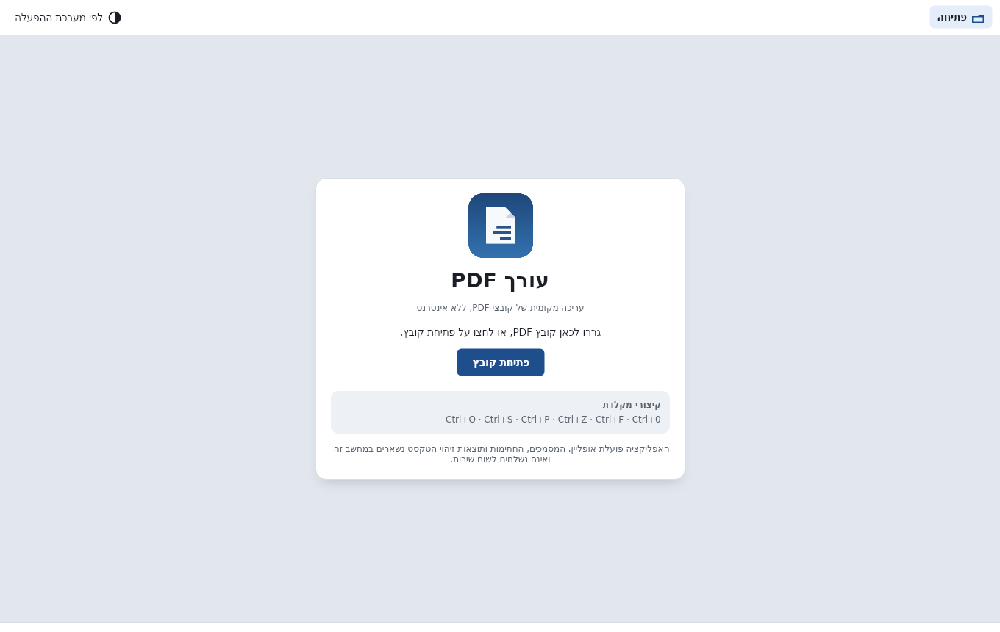
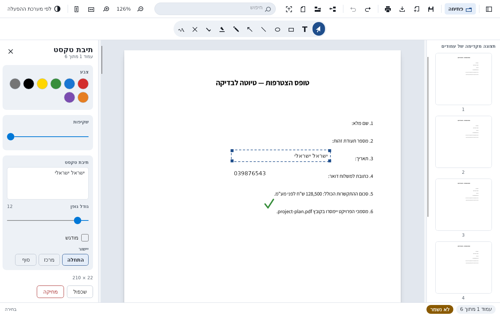
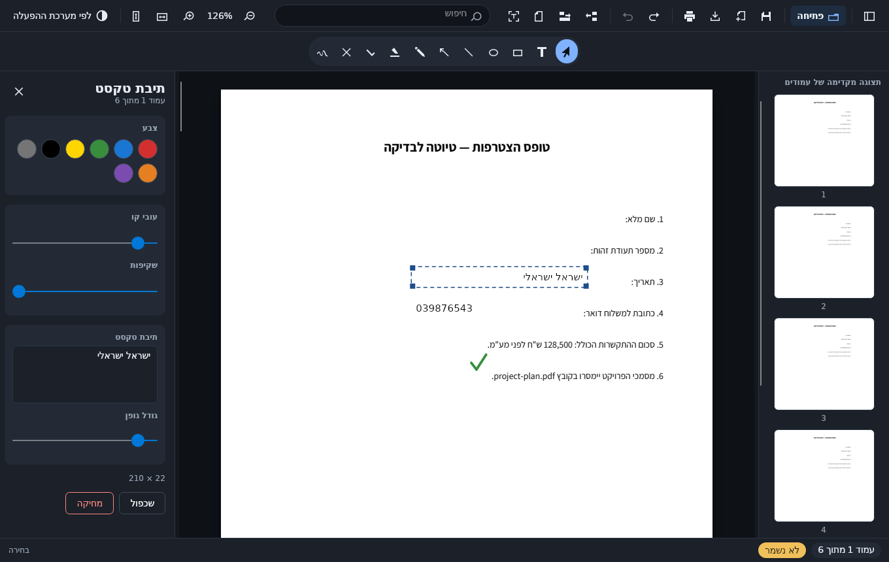
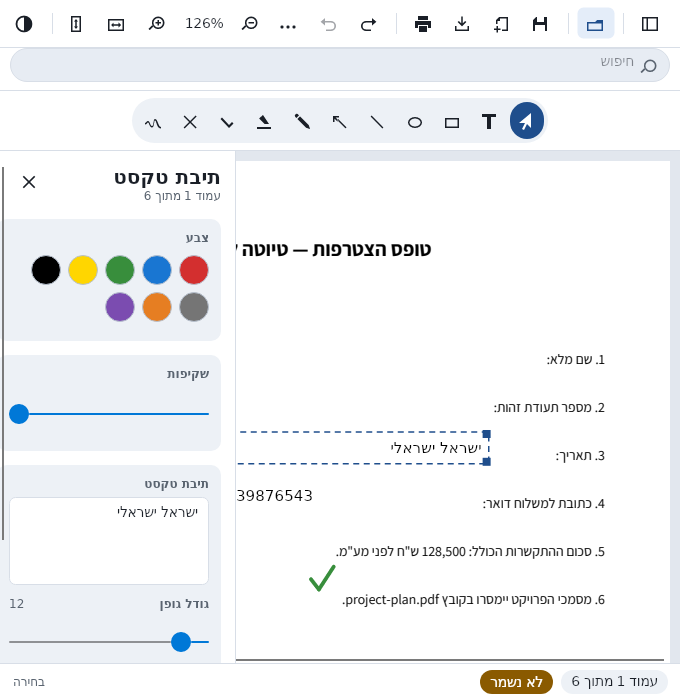
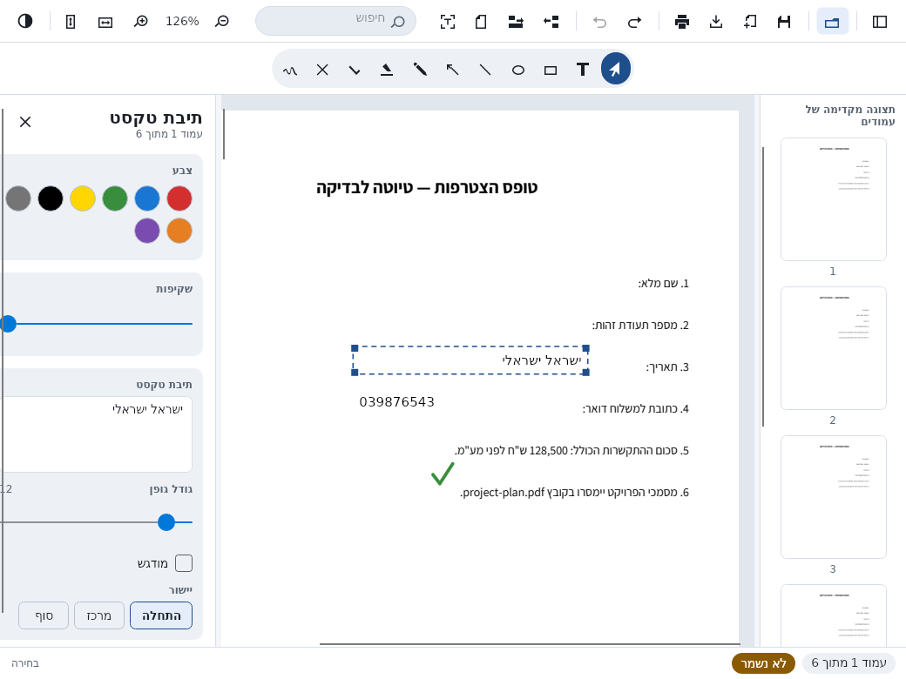
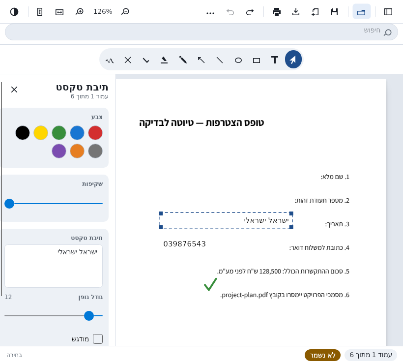
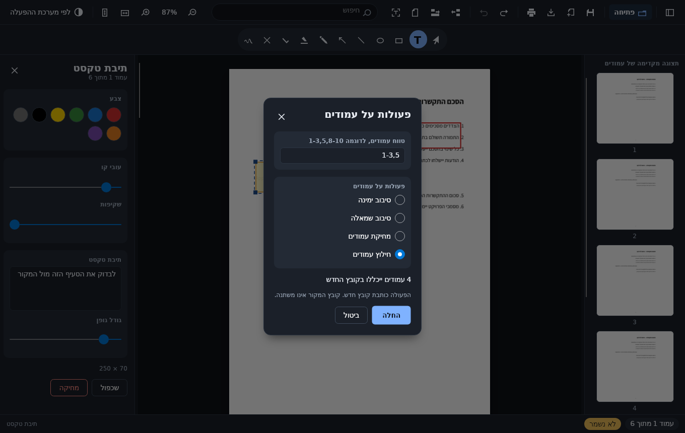

# PDF Editor — עורך PDF

A local, offline PDF editor for Windows, with a Hebrew, right-to-left interface.

It opens a PDF, lets you annotate it, keeps the annotations editable when you save, and can print,
merge, split, reorder and run OCR — all on your own machine. It has no accounts, no cloud, no
telemetry and no network calls at all. Nothing you open ever leaves the computer.

> **Project status: pre-release.** The application builds, the whole test suite passes, and a
> self-contained Windows package is produced by the build scripts. It has **not yet been run on
> Windows** and printing has never reached a physical printer. See
> [Known limitations](#known-limitations) — nothing here is claimed as verified unless it is.

## Screenshots

Captured from the real application rendering headlessly; they are not mockups.

| Start screen |
| --- |
|  |

Filling a form in: a name and an identity number placed as plain text, with the dashed guide the
editor draws around the selected field. That guide never reaches the PDF.

| Editing, light theme | Editing, dark theme |
| --- | --- |
|  |  |

At a narrow window the shell rearranges itself: the thumbnail rail closes, the side panels float
over the document instead of squeezing it, the search field takes a row of its own and the document
operations move into an overflow menu.



The three breakpoints, from the width where labels stop fitting to the width where the panels start
floating:

| Medium — 1040 | Compact — 820 |
| --- | --- |
|  |  |

Every image above is produced by `tools/PdfEditor.Shots`, which boots the real application
headlessly and captures it. Run `dotnet run --project tools/PdfEditor.Shots -- artifacts/shots` to
regenerate them.

Rotating, deleting and extracting pages happens in one dialog, and always writes a new file.



## What it does

**Viewing**
- Open by file picker or by dropping a PDF onto the window.
- Continuous page view with virtualisation, a thumbnail rail, and page navigation.
- Zoom in and out, fit width, fit page, actual size.
- Long operations report progress and can be cancelled; the interface thread is never blocked.

**Filling forms**
- Text is placed **plain** — no background, no border — so a name, an identity number or a date
  looks like it belongs on the page rather than stuck to it. What reaches the PDF is the glyphs.
- An empty field is outlined with a faint dashed guide so it cannot be lost before it is typed
  into. The guide is drawn by the editor only and is never written to the file.
- Real bidirectional layout, so digits and Latin inside a Hebrew line keep their place.

**Annotating**
- Hebrew text boxes with real bidirectional layout, rectangles, ellipses, lines, arrows, freehand
  ink, highlight, check and cross marks, and graphical signatures.
- Colour, line width, opacity and font size, with a properties panel for the selection.
- Copy, paste, duplicate, delete, undo and redo.
- Annotations are written as **standard PDF annotations**, so other viewers show them and this
  editor can reopen and edit them. A private key inside each annotation carries the exact editing
  state so a round trip loses nothing.

**Saving**
- Save and Save As, written atomically — the original is replaced only once the new file is
  complete on disk.
- **Export final copy** flattens the annotations into the page content and always writes a *new*
  file. The source is never overwritten by an export.
- Closing the window with unsaved changes asks first. There is no path that discards work silently.
- **Autosave and crash recovery.** Unsaved annotations are written to a sidecar every 45 seconds and
  offered back if a run ends without shutting down. The document itself is never copied or touched,
  and a clean exit leaves nothing behind to offer. What the sidecar holds, and for how long, is
  spelled out in `docs/PRIVACY.md`.

**Document operations**
- Merge several documents into a new file, and split a document into one file per page.
- Rotate, delete and extract pages by range. Every one of these writes a **new** file, so a wrong
  range costs nothing and the open document is never modified.
- Page ranges are written the usual way (`1-3,5,8-10`), with Hebrew error messages that name the
  part that could not be read.
- Reordering pages is implemented and tested in the engine but is not reachable from the interface
  yet.

**OCR**
- Fully offline Hebrew and English recognition using Tesseract with bundled language data.
- On demand, cancellable, with progress, and cached per file and page.
- Version 1 **does not** modify the PDF: no invisible text layer is added and no existing text is
  edited. OCR is used for searching and for copying text out.

**Printing**
- A print preview that shows the exact sheet sequence.
- An option — *"הדפס כל עמוד תוכן על גיליון נפרד"* — that interleaves blank pages so a printer
  forcing double-sided output still puts one content page on each sheet. It builds a temporary job
  and never modifies the source. What a driver or a print server finally does with that sequence is
  outside any application's control, and the interface says so.

**Signatures**
- Placing the signature tool opens the library: import a signature from a PNG or JPEG, pick one to
  place, or delete one for good.
- An imported image is auto-cropped, given a transparent background, and kept per Windows user
  under DPAPI protection. "Remove white background" is on by default, because a signature scanned
  from paper would otherwise stamp a white box onto the page.
- Nothing is added to the page until a signature is chosen, so cancelling leaves the document
  untouched, and the placed rectangle takes the image's proportions rather than stretching it.
- The dialog states plainly that this is a graphical signature and **not** a verified digital
  signature.
- Drawing a signature freehand is not implemented; the ink tool is the workaround.

## System requirements

- Windows 10 or 11, x64.
- No installer, no administrator rights, no .NET installation — the package is self-contained.
- About 120 MB of disk space for the unpacked portable folder (a 53 MB download).
- No network access is needed at any point after the package is built.

## Running it

Download or build the portable folder, unzip it anywhere, and run `PdfEditor.exe`.

The executable is **not code-signed**, so Windows SmartScreen will warn the first time it runs. A
SHA-256 checksum is published beside every artifact so the download can be verified instead;
`docs/RELEASE.md` covers this.

## Building from source

Requires the .NET 8 SDK. Building on Linux works and is how the Windows package is produced in CI.

```bash
git clone https://github.com/noamh98/Pdf_editor.git
cd Pdf_editor

# Fetch the bundled font and OCR language data. These are binary and deliberately not committed.
build/fetch-assets.sh          # build\fetch-assets.ps1 on Windows

build/build.sh                 # restore and build everything
build/test.sh                  # run every test project
build/package.sh               # portable folder + zip + SHA256SUMS.txt under artifacts/
```

`docs/BUILD.md` has the full instructions, including troubleshooting and what each script checks.

## Tests

```bash
build/test.sh
```

428 tests across four projects, all passing at the current commit:

| Project | Tests | Covers |
| --- | --- | --- |
| `PdfEditor.Core.Tests` | 177 | Page range parsing, the bidirectional algorithm and its UAX#9 conformance, undo/redo, print sequencing, safe paths, atomic writes |
| `PdfEditor.Pdf.Tests` | 83 | Open, render, annotate, save, reopen, flatten, merge, split, reorder, rotate, and the recovery sidecar — against real PDFs |
| `PdfEditor.Ocr.Tests` | 82 | OCR geometry, Hebrew normalisation, the cache, the signature store, temporary file cleanup |
| `PdfEditor.App.Tests` | 86 | The window itself, headless: right-to-left layout, responsive breakpoints, shortcuts, page operations, form filling, signatures, and both unsaved-work paths |


Tests that must not change a source file hash it before and after and assert it is untouched.
`docs/TESTING.md` describes the strategy, the synthetic corpus, and what is covered by a manual
smoke test rather than automation.

## Privacy

This is the part that is not negotiable, and it is enforced by a check in CI rather than promised:

- No network calls of any kind at runtime. No telemetry, no analytics, no crash upload, no update
  check, no remote fonts or assets.
- No cloud OCR. Recognition runs locally against language data inside the package.
- Nothing you open is copied anywhere outside the folders listed in `docs/PRIVACY.md`.
- Logs hold metadata only. Document text, OCR results and signature images are never logged.
- Recent files, the OCR cache, recovery files, temporary files and saved signatures can all be
  cleared from inside the application.

A CI job greps the source for networking APIs and remote URLs and fails the build if one appears.
`docs/PRIVACY.md` and `docs/THREAT_MODEL.md` have the details, including exactly which files are
written and where.

## Offline use

The application never needs a network — not at first run, not for OCR, not for fonts. The only step
that downloads anything is `build/fetch-assets`, which is a build-time step run once by whoever
builds the package.

## Known limitations

The honest list lives in [`docs/KNOWN_LIMITATIONS.md`](docs/KNOWN_LIMITATIONS.md). The most
important entries:

- **Never run on Windows.** Developed and tested on Linux; the Windows package is cross-published.
- **Printing has never reached a physical printer.** The sequencing is unit tested and the preview
  is generated by the same code that builds the job, but the end-to-end path is unverified.
- **OCR accuracy is not covered by automated tests** — the Tesseract package ships Windows-only
  native libraries.
- **Performance budgets are targets, not measurements.**
- Annotations created by other applications are preserved exactly but are shown in the editor as a
  labelled placeholder rather than with their true appearance.
- Page reordering has no interface yet, although it is implemented and tested underneath. A
  signature can be imported and placed, but not drawn freehand.
- Password-protected documents are opened read-only and reported as protected.
- The executable is not code-signed.

## Documentation

| Document | What it covers |
| --- | --- |
| [`docs/PLAN.md`](docs/PLAN.md) | Scope, architecture, milestones, risks, acceptance criteria |
| [`docs/PLAN_REVIEW.md`](docs/PLAN_REVIEW.md) | A critical reading of that plan, and what it failed to catch |
| [`docs/ARCHITECTURE.md`](docs/ARCHITECTURE.md) | Module boundaries, threading, data flow |
| [`docs/adr/`](docs/adr) | Architecture decision records, with the rejected alternatives |
| [`docs/BUILD.md`](docs/BUILD.md) | Building, packaging, troubleshooting |
| [`docs/TESTING.md`](docs/TESTING.md) | Test strategy and the manual smoke test |
| [`docs/PRIVACY.md`](docs/PRIVACY.md) | Every file written, and why |
| [`docs/THREAT_MODEL.md`](docs/THREAT_MODEL.md) | Threats, mitigations, residual risk |
| [`docs/PRINTING.md`](docs/PRINTING.md) | The forced-duplex workaround and its limits |
| [`docs/OCR.md`](docs/OCR.md) | The OCR pipeline, cache and measured accuracy |
| [`docs/SIGNATURE_STORAGE.md`](docs/SIGNATURE_STORAGE.md) | How signatures are stored and protected |
| [`docs/DEPENDENCIES.md`](docs/DEPENDENCIES.md) | Every dependency, its licence and its risk |
| [`docs/RELEASE.md`](docs/RELEASE.md) | Release checklist and artifact verification |
| [`THIRD_PARTY_NOTICES.md`](THIRD_PARTY_NOTICES.md) | Attribution for bundled components |
| [`CONTRIBUTING.md`](CONTRIBUTING.md) | Conventions, commit style, quality gates |

## Licensing

Every dependency is free and redistributable — MIT, Apache-2.0, BSD or SIL OFL. Each one is listed
in `docs/DEPENDENCIES.md` with its version, licence, source, and whether it ships inside the
package or beside it. There is no commercial, trial or AGPL component.

**This project has no `LICENSE` file yet.** That is deliberate: the licence of the code in this
repository is the owner's decision, not something to be picked by default. Until one is added, the
code is under exclusive copyright. `docs/RELEASE.md` records the recommendation (MIT) and what
adding it entails.

## Keyboard shortcuts

| Shortcut | Action |
| --- | --- |
| `Ctrl+O` | Open |
| `Ctrl+S` / `Ctrl+Shift+S` | Save / Save As |
| `Ctrl+P` | Print |
| `Ctrl+Z` / `Ctrl+Y` / `Ctrl+Shift+Z` | Undo / Redo |
| `Ctrl+F` | Search |
| `Ctrl+C` / `Ctrl+V` / `Ctrl+D` | Copy / Paste / Duplicate |
| `Delete` / `Escape` | Delete selection / Clear selection |
| `Ctrl++` / `Ctrl+-` / `Ctrl+0` | Zoom in / Zoom out / Fit page |
| `Ctrl+B` | Show or hide the thumbnail rail |
| `PageUp` / `PageDown` | Previous / next page |

Editing keys are suppressed while you are typing inside an annotation, so they never fight with the
text you are writing.
