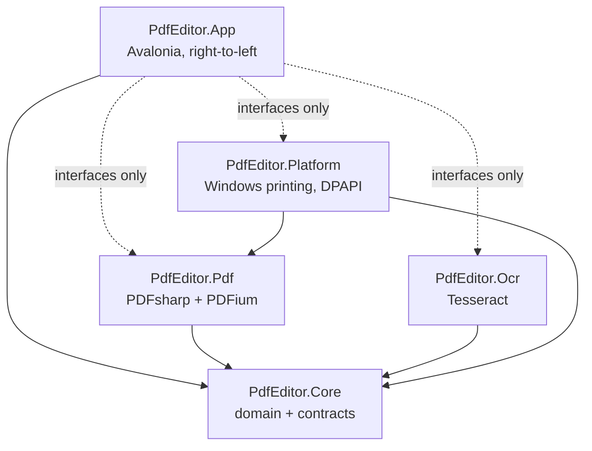

# Architecture

## Shape

Five projects, one dependency rule: **`PdfEditor.Core` depends on nothing but the base class
library, and everything else depends on Core and never on a sibling.** The one exception is
`PdfEditor.Platform`, which references `PdfEditor.Pdf` for the print-job document type.



The UI holds interfaces — `IPdfDocument`, `IPdfDocumentWriter`, `IDocumentAssembler`, `IOcrEngine`,
`ISignatureLibrary`, `IPrintService` — and is handed concrete implementations by `AppServices`, a
hand-written composition root. That is what makes headless UI tests possible without a PDF engine,
and what would make replacing an engine a change in one project.

| Project | Target | Runs on | Responsibility |
| --- | --- | --- | --- |
| `PdfEditor.Core` | net8.0 | anywhere | Annotation model, UAX#9 bidi, page ranges, undo/redo, print sequencing, atomic writes, safe file names, application paths, settings, Hebrew strings, every service contract |
| `PdfEditor.Pdf` | net8.0 | anywhere | Open, render, read and write annotations, flatten, merge, split, build print jobs |
| `PdfEditor.Ocr` | net8.0 | builds anywhere, recognises on Windows | Tesseract engine, pixel-to-PDF geometry, Hebrew-aware search index, result cache |
| `PdfEditor.Platform` | net8.0 | builds anywhere, prints and protects on Windows | Windows printing, DPAPI signature storage, temporary file cleanup |
| `PdfEditor.App` | net8.0 | Windows (headless tests anywhere) | Views, view models, theming, keyboard, dialogs |

Windows-only APIs sit behind `OperatingSystem.IsWindows()` guards and `[SupportedOSPlatform]`
annotations rather than a Windows target framework, so the whole solution compiles and unit-tests on
Linux. That is not a portability goal — it is what makes the work verifiable at all in an
environment where no Windows machine is available.

## The three hard parts

### 1. Hebrew in a PDF

PDF text operators place glyphs in the order supplied. Handing them a logical-order Hebrew string
produces reversed text, and — worse — mixed content comes out subtly wrong while still looking
plausible. `PdfEditor.Core.Text.BidiAlgorithm` implements UAX#9 (P2–P3, X1–X10, W1–W7, N0–N2, I1–I2,
L1–L4) and everything that draws text runs through it. `TextLayout` then measures and wraps so text
never overflows the box it was drawn into. See `docs/adr/0004-own-bidi-implementation.md`.

### 2. Annotations that are re-editable *and* visible elsewhere

Each annotation is written as a standard PDF annotation dictionary **with an appearance stream we
generate**, because PDFium — the engine behind Chrome and Edge — draws nothing for a `/FreeText`
without one. PDFsharp 6.2 keeps the Form XObject behind `XForm` internal, so the appearance is built
by drawing onto a temporary page, lifting its content stream and resource dictionary into a
`/Subtype /Form` object, and removing the page.

Standard entries alone cannot round-trip everything the editor needs — alignment, base direction,
font size, per-stroke ink geometry — so a compact JSON payload is stored under a private key in the
annotation dictionary. The specification permits private keys and other viewers ignore them, so an
annotation reopens exactly as authored while still rendering everywhere.
See `docs/adr/0003-annotation-appearance-streams.md`.

### 3. Never damaging the source

Two save modes, deliberately separate: **Save** keeps annotations editable, **Export Final Copy**
flattens them into a new file after warning that it cannot be undone. All output goes through
`AtomicFileWriter` — temporary file, flush to disk, `File.Replace` — so an interrupted save cannot
truncate an existing document. Work always happens on a fresh copy parsed from the bytes the
document was loaded from, never on the live object the UI is reading. The test suite asserts the
source file's SHA-256 is unchanged after Save As, Export, merge and split.
See `docs/adr/0008-save-versus-export.md`.

## How a page reaches the screen

```
IPdfDocument.RenderAsync
  -> semaphore (PDFium is not re-entrant per document)
    -> Task.Run: PDFium rasterises WITHOUT annotations
      -> BGRA byte[]
        -> Dispatcher.UIThread: WriteableBitmap assigned to PageViewModel.Bitmap
PageSurface.Render
  -> draws the bitmap
    -> AnnotationOverlay draws the annotation model on top
      -> selection outline and handles
```

The bitmap deliberately excludes annotations and the overlay supplies them from the model, so an
edit appears immediately without re-rasterising the page. The cost is that a third-party annotation,
whose appearance lives only in its stream, is shown as a labelled placeholder in the editor — it is
preserved untouched in the file and drawn for real on export.

Rendering is driven by the visual tree: a virtualising panel realises only the pages in view, so
`OnAttachedToVisualTree` is the moment a page needs its bitmap and `OnDetachedFromVisualTree` is the
moment it can release it. Thumbnails are a separate, small, fixed-width render that survives while
the full-resolution bitmap is discarded.

## Threading

The UI thread never opens, parses, renders, recognises, merges or writes a PDF. Every long operation
takes a `CancellationToken` supplied by the view model, and `MainWindowViewModel` owns one operation
scope at a time so the status bar's cancel button always applies to the work in flight.

`AsyncRelayCommand` reports itself unavailable while running, so a second click cannot start the
same operation twice.

## Errors

Every failure a user can cause is a typed value, not an exception message: `PdfOpenError`,
`PageRangeError`, `PrintJobResult`. `ErrorMessages` maps them to Hebrew, wrapping embedded file
names and ranges in Unicode isolates so a Latin token never scrambles the surrounding sentence.
A PDF is untrusted input, so any parser failure other than cancellation or memory exhaustion becomes
`PdfOpenError.Corrupted` rather than escaping — PDFsharp signals some malformations with a bare
`Exception`.

## Storage

Everything under `%LOCALAPPDATA%\PdfEditor`: settings, recent files, signatures, the OCR cache,
recovery files, temporary print jobs and logs. Local rather than roaming, so nothing is
synchronised. `AppPaths.ClearDirectory` refuses any path outside that root.

## Where to start reading

| To understand | Read |
| --- | --- |
| Hebrew handling | `Core/Text/BidiAlgorithm.cs`, then `Pdf/Annotations/TextLayout.cs` |
| How an annotation is stored | `Pdf/Annotations/AnnotationWriter.cs` and `AnnotationSerializer.cs` |
| Why flattened output matches the editable view | `Pdf/Annotations/AnnotationRenderer.cs` |
| Save safety | `Core/Files/AtomicFileWriter.cs`, `Pdf/Documents/PdfDocumentWriter.cs` |
| The printing feature | `Core/Printing/PrintSequenceBuilder.cs`, then `docs/PRINTING.md` |
| The interface | `App/Views/MainWindow.axaml`, `App/ViewModels/MainWindowViewModel.cs` |
| Editing interaction | `App/Controls/PageSurface.cs` |
