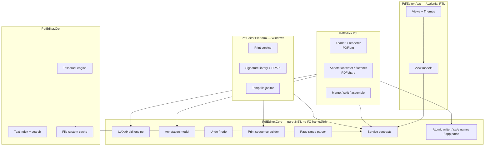

# PDF Editor — Product and Engineering Plan

Status: living document. Last revised during milestone 2 (architecture and proofs of concept).
Language note: repository documentation is written in English; every string shown to a user is Hebrew.

---

## 1. Product goal

A local, offline Windows desktop application for reviewing and annotating PDF files, aimed at a
Hebrew-speaking user who needs to mark up documents, sign them graphically, reorganise pages and
print them reliably on a printer that forces duplex.

The product optimises, in this order:

1. Never damaging a source document.
2. Privacy — nothing leaves the machine.
3. Stability and predictable behaviour.
4. A polished, genuinely right-to-left Hebrew interface.
5. Breadth of features.

## 2. Scope of version 1

| Area | In scope |
| --- | --- |
| Viewing | Open by dialog or drag-and-drop, page view, thumbnails, zoom (in/out/fit width/fit page/100%), view rotation, smooth virtualised scrolling |
| Annotating | Text box (Hebrew), rectangle, ellipse, line, arrow, freehand ink, highlight, check mark, cross mark, graphical signature; colour, line width, opacity; move, resize, duplicate, delete, copy/paste |
| Saving | Save / Save As keeping annotations editable; Export Final Copy that flattens them into a new file |
| History | Undo/redo, session autosave, crash recovery |
| Pages | Merge several files, extract ranges, split one file per page, delete, rotate, reorder |
| OCR | Local Tesseract recognition for Hebrew and English, search within recognised text, copy recognised text, highlight hits |
| Signatures | Local signature library: draw, import, auto-crop, name, reuse, delete |
| Printing | Print preview and the "one content page per sheet" blank-page interleaving workflow |
| Platform | Windows 10 and 11 x64, portable, no installer, no administrator rights, no network |

### Non-goals for version 1

- Editing text that already exists inside the PDF.
- Adding an invisible OCR text layer to the file, or changing the PDF because of OCR.
- Cryptographic digital signatures. The signature feature is graphical only and says so in the UI.
- Opening password-protected or permission-restricted documents for editing.
- Forms filling (AcroForm) beyond preserving existing form objects untouched.
- Any cloud service, account, telemetry, update check or paid component.
- macOS and Linux builds. The core libraries are cross-platform, but only Windows is supported.

## 3. Users and primary flows

**Persona — the reviewer.** Receives PDFs by email, marks them up, signs them, sends them back.
Works in Hebrew, mixes Hebrew and English in the same sentence, cares that file names and numbers
are not scrambled.

Primary flows:

1. Open → read → add a text note and a check mark → Save → reopen later and edit the same note.
2. Open → place a stored signature → Export Final Copy → send the flattened copy.
3. Select several files → order them → Merge → save a new combined file.
4. Open a 300-page scan → run OCR on the pages of interest → search a Hebrew term → copy a quote.
5. Open → Print → enable "print every content page on its own sheet" → check the preview → print.
6. Application is killed → restart → recover the unsaved annotations.

## 4. Architecture



**Dependency rule.** `PdfEditor.Core` depends on nothing but the base class library. Every other
project depends on Core and never on a sibling, except `PdfEditor.Platform`, which references
`PdfEditor.Pdf` only for the print-job document type. The UI depends on interfaces, never on a
concrete engine, which is what makes headless tests and stub services possible.

### Modules

| Project | Target | Responsibility |
| --- | --- | --- |
| `PdfEditor.Core` | net8.0 | Domain model, bidi, page ranges, undo/redo, print sequencing, contracts, file safety, Hebrew strings |
| `PdfEditor.Pdf` | net8.0 | Open, render, read/write annotations, flatten, merge, split, build print jobs |
| `PdfEditor.Ocr` | net8.0 | Tesseract wrapper, geometry mapping, search index, result cache |
| `PdfEditor.Platform` | net8.0 | Windows printing, DPAPI-protected signature storage, temporary file cleanup |
| `PdfEditor.App` | net8.0 | Avalonia UI, view models, theming, keyboard, dialogs |

### Data flow

Opening a document produces an `IPdfDocument` plus a list of `Annotation` objects. The view models
own the mutable annotation list; every edit goes through the undo stack. Rendering is a pull model:
a page view model asks for a bitmap at the current scale, the request is queued, and the result is
pushed back on the UI thread. Saving serialises the annotation list into the document through the
annotation writer; exporting runs the same drawing code into the page content stream instead.

### State management

- One `DocumentSession` per open document: the loaded document, the annotation list, the undo
  stack, the dirty flag, the autosave timer and the render cache.
- The dirty flag is derived from the undo stack depth versus the depth at the last save, so undoing
  back to the saved point correctly reports "no unsaved changes".
- Selection, active tool and zoom are UI state and are not part of the undo history.

### Threading and cancellation

- The UI thread never opens, parses, renders, recognises, merges or writes a PDF.
- Rendering, thumbnailing, OCR, merge, split, export and print-job preparation all run on the
  thread pool, each with a `CancellationToken` supplied by the view model.
- PDFium is serialised per document behind a semaphore; it is not re-entrant in this binding.
- Scroll-driven render requests are debounced, and requests for pages that have scrolled out of
  view are cancelled rather than completed.

### Error handling

Every failure that a user can cause is a typed error, not an exception message: `PdfOpenError`,
`PageRangeError`, and typed print results. The UI maps them to Hebrew sentences through
`ErrorMessages`. Unexpected exceptions are caught at the command boundary, shown as a generic
Hebrew error, and recorded in a local log that contains no document content.

### Storage and cache

Everything is written under `%LOCALAPPDATA%\PdfEditor` (never roaming, never synchronised):

| Path | Contents | Cleared by |
| --- | --- | --- |
| `settings.json` | User preferences | Settings → reset |
| `recent.json` | Recently opened paths | "נקה רשימת קבצים אחרונים" |
| `signatures\` | Signature metadata + DPAPI-protected payloads | "מחיקת כל החתימות" |
| `ocr-cache\` | Recognition results keyed by a content hash | "נקה מטמון זיהוי טקסט", plus age-based pruning |
| `recovery\` | Autosaved annotation sidecars | After a successful save, on discard, or "נקה קובצי שחזור" |
| `temp\` | Print jobs and intermediate files | On job completion and at next startup |
| `logs\` | Metadata-only diagnostics | "נקה קבצים זמניים" |

### Privacy

No socket is opened at runtime. No analytics, no update check, no crash upload, no remote fonts or
assets. Logs record operation names, durations and error codes only — never file names, page text,
OCR output or signature data. See `docs/PRIVACY.md` and `docs/THREAT_MODEL.md`.

### Printing pipeline

```
document + selection
      -> PrintSequenceBuilder (pure, unit tested)
      -> PrintSequence { slots, content count, blank counts }
      -> preview strip in the UI
      -> IPrintJobBuilder materialises a temporary PDF
      -> IPrintService renders each page and sends it to the Windows printer
      -> TempFileJanitor deletes the temporary job
```

The source document is never modified and no new PDF is saved to the user's folders.

## 5. Test strategy

| Layer | Approach | Runs on |
| --- | --- | --- |
| Core | xUnit unit tests, no I/O except temp directories | Linux + Windows |
| Pdf | Integration tests over synthetic fixtures generated in code | Linux + Windows |
| Ocr | Pure logic (geometry, index, cache) unit tested; the Tesseract binding is Windows-only | Linux for logic, Windows for recognition |
| Platform | Signature storage and janitor unit tested; printing is Windows-only | Linux for storage, Windows for printing |
| App | Avalonia headless UI tests | Linux + Windows |
| End to end | Documented manual smoke checklist, including physical printer protocol | Windows, manual |

Output verification after every save or export: the file exists, is non-empty, reopens, has the
expected page count and page sizes, has annotations or none as the mode requires, and the source
file's SHA-256 is unchanged.

## 6. Packaging strategy

`dotnet publish -c Release -r win-x64 --self-contained true` producing a portable folder plus a
single-file variant. No installer, no administrator rights, no first-run download. Bundled assets:
the Hebrew-capable font and the `heb`/`eng` Tesseract language data. A build produced from this
environment is 44 MB before OCR assets are added.

## 7. Milestones

| # | Milestone | Gate |
| --- | --- | --- |
| 1 | Repository, toolchain, CI skeleton | Builds clean |
| 2 | Architecture, proofs of concept, plan and review | Gate 1 |
| 3 | Design system and RTL shell | Gate 2 (partial) |
| 4 | Viewer and virtualisation | Gate 2 |
| 5 | Annotation engine | Gate 3 |
| 6 | Save, reopen, flatten export | Gate 3 |
| 7 | Undo, autosave, crash recovery | Gate 3 |
| 8 | Page operations, merge, split | Gate 4 |
| 9 | OCR | Gate 5 |
| 10 | Signature library | Gate 5 |
| 11 | Printing workflow | Gate 6 |
| 12 | Accessibility and UX polish | Gate 6 |
| 13 | Performance hardening | Gate 6 |
| 14 | Security and privacy review | Gate 7 |
| 15 | QA, packaging, release | Gate 7 |

## 8. Performance budgets

Measured on the development machine described in `docs/TESTING.md`. These are targets, and the
document records the measured values separately — no number in this table is claimed as achieved
until `docs/TESTING.md` shows a measurement.

| Operation | Budget |
| --- | --- |
| First page visible after open (100-page file) | < 1.2 s |
| Page render at 100% zoom | < 120 ms |
| Zoom step response | < 150 ms |
| Thumbnail for one page | < 80 ms |
| Page-to-page navigation | < 100 ms |
| Steady-state memory, 500-page document | < 900 MB |
| Export of a 100-page annotated document | < 6 s |

## 9. Risk register

| # | Risk | Impact | Mitigation | State |
| --- | --- | --- | --- | --- |
| R1 | Annotations written by the app are not re-editable or not rendered by other viewers | High | Generate standards-compliant dictionaries with our own appearance streams; verified rendering through PDFium, the engine behind Chrome and Edge | Mitigated by POC |
| R2 | Hebrew text drawn into a PDF comes out scrambled | High | Full UAX#9 implementation in Core with 37 unit tests; verified by an OCR round trip | Mitigated by POC |
| R3 | Tesseract ships Windows-only natives, so OCR cannot be tested in CI on Linux | Medium | Engine abstraction plus pure, testable geometry and index layers; recognition verified with the Tesseract CLI and documented as Windows-only in automated tests | Accepted, documented |
| R4 | Forced-duplex workaround depends on driver behaviour | Medium | Implement the correct sequence, show an accurate preview, document the limitation in the UI and in `docs/PRINTING.md` | Accepted, documented |
| R5 | Single-file publish extracts natives to a temporary folder on first run | Low | Ship the portable folder as the primary artifact and the single file as a convenience | Mitigated |
| R6 | Avalonia's screen-reader support is less mature than WPF's | Medium | Full keyboard operation, automation names on every control, and an honest note in `docs/KNOWN_LIMITATIONS.md` | Accepted, documented |
| R7 | Memory growth on very large documents | Medium | Virtualised rendering, bounded page cache with eviction, thumbnails at a fixed small size | Planned |
| R8 | DPAPI ties signatures to the Windows account, so a copied portable folder loses them | Low | Documented behaviour; the library reports it in the UI | Accepted, documented |
| R9 | A malformed PDF crashes or hangs the renderer | Medium | Treat every PDF as untrusted, wrap parsing in typed errors, fuzz-style malformed fixtures in the test suite | Planned |

## 10. Acceptance criteria

1. A local PDF opens by dialog and by drag-and-drop.
2. Text boxes, shapes, marks, ink, highlight and signatures can be added, moved, resized and deleted.
3. Hebrew and English text render and save correctly, including numbers, dates and file names.
4. Save keeps annotations editable; reopening finds them and allows further editing.
5. Export Final Copy produces a flattened new file and leaves the source byte-identical.
6. Undo and redo cover every editing action.
7. Autosave and crash recovery restore unsaved work after a forced termination.
8. Merge, split, extract, delete, rotate and reorder produce valid new files.
9. OCR recognises Hebrew and English locally and its results are searchable and copyable.
10. Signatures are stored locally, protected, and can be deleted permanently.
11. The blank-page print sequence is correct for odd and even page counts, existing blanks, subsets,
    portrait and landscape, and matches the preview.
12. The interface is fully right-to-left, works in light and dark themes, and is keyboard operable.
13. No network traffic occurs at runtime.
14. A self-contained portable build runs on a clean Windows 10 or 11 machine.

## 11. Definition of done

Every acceptance criterion above is demonstrated, the critical automated tests pass, the limitations
list in `docs/KNOWN_LIMITATIONS.md` is truthful and complete, the dependency and licence inventory
is accurate, a release artifact with a published SHA-256 exists, and `docs/HANDOFF.md` lets another
engineer build, test, package and continue the work without asking a question.
